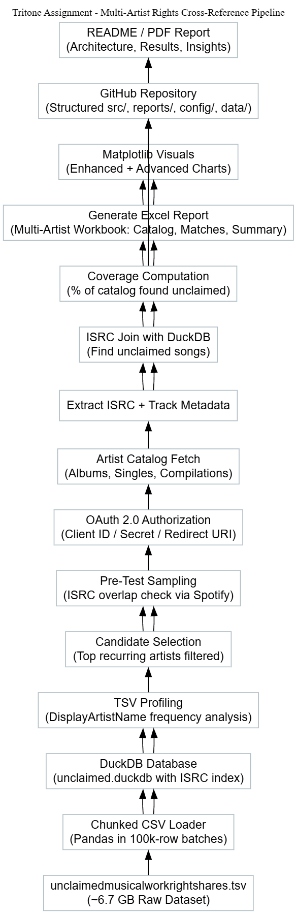

End-to-end data pipeline for cross-referencing Spotify track catalogs with unclaimed musical work rights using ISRC codes. Built with DuckDB, Spotipy, and Python for large-scale rights analytics and catalog verification.

# Crossref-ISRC-Spotify

### Multi-Artist Rights Analytics and Cross-Referencing Pipeline

This repository implements a complete, modular Python pipeline that cross-references Spotify artist catalogs against a 6.7 GB dataset of unclaimed musical work rights.  
The objective is to identify potential overlaps, unclaimed ISRCs, and missing rights metadata by efficiently combining API-driven data retrieval with large-scale local analytics.

---

## 1. Overview

The project demonstrates an end-to-end data analytics and integration system designed for music rights research.  
It leverages DuckDB for columnar analytical storage, Spotipy for authenticated Spotify API access, and pandas for data manipulation and reporting.

The workflow consists of:

1. Ingesting and indexing the `unclaimedmusicalworkrightshares.tsv` dataset (~6.7 GB).
2. Extracting and normalizing artist catalogs from Spotify using OAuth 2.0.
3. Cross-referencing ISRC codes across both datasets to detect matches or missing works.
4. Exporting analytical summaries, Excel reports, and high-resolution visualizations.

---

## 2. Repository Structure

```

tritone-assignment/
│
├── src/
│   ├── core/           # Configuration, setup, verification scripts
│   ├── ingest/         # TSV ingestion and DuckDB schema creation
│   ├── spotify/        # Spotify API and catalog retrieval logic
│   ├── match/          # Cross-referencing and ISRC comparison modules
│   └── analysis/       # Artist profiling and visualization scripts
│
├── data/
│   ├── raw/            # Original TSV dataset (excluded from Git)
│   ├── interim/        # Intermediate Spotify catalog exports
│   └── processed/      # DuckDB analytical database
│
├── reports/
│   ├── tritone_multi_artist_report.xlsx   # Final multi-artist cross-reference workbook
│   ├── figures_enhanced/                  # Enhanced visual summaries
│   └── figures_advanced/                  # Advanced comparative visualizations
│
├── config/             # Project configuration files (settings.toml)
├── logs/               # Runtime logs (excluded from Git)
├── docs/               # Documentation and notes
├── requirements.txt
├── .env.example
├── .gitignore
└── README.md

````

---

## 3. Technical Architecture



The following summarizes the architecture and key data flow stages:

1. **Data Ingestion (DuckDB + Chunked TSV Loader)**  
   The unclaimed works dataset is ingested in streaming batches of 100k rows per iteration.  
   A DuckDB database (`unclaimed.duckdb`) is created, with an indexed `ISRC` column for optimized lookup.

2. **Artist Discovery (Reverse Engineering)**  
   Instead of manually guessing artists, the system profiles the TSV to identify frequently occurring `DisplayArtistName` values.  
   Top recurring names are selected for cross-referencing.

3. **Spotify Integration (OAuth 2.0 + Spotipy)**  
   - Uses the Spotify Web API via authenticated access tokens.  
   - Retrieves complete catalogs for each selected artist (albums, singles, EPs).  
   - Extracts ISRC, track title, album, and release date.

4. **Cross-Referencing (ISRC Join Logic)**  
   The pipeline performs a direct ISRC-based join between the Spotify catalog and DuckDB tables to locate unclaimed or overlapping works.  
   It supports both single-artist and multi-artist runs.

5. **Reporting and Visualization (Excel + Matplotlib)**  
   - The final output is a multi-sheet Excel workbook:
     - *Catalog Sheets* (track-level metadata)
     - *Matches Sheets* (ISRC overlaps)
     - *Summary Sheet* (coverage statistics)
   - Visualizations include:
     - Stacked and gradient bar charts (matched vs unmatched)
     - Bubble and radar charts (catalog size vs coverage)
     - Donut and composition graphs for artist-level summaries.

---

## 4. Environment Setup

### Prerequisites
- Python 3.10 or higher  
- Spotify Developer Account for API credentials  
- Git and pip installed locally  

### Installation

```bash
# Clone the repository
git clone https://github.com/brucewayneoptimusprime/Crossref-isrc-spotify.git
cd Crossref-isrc-spotify

# Create and activate virtual environment
python -m venv .venv
source .venv/bin/activate          # (Linux/Mac)
.venv\Scripts\activate             # (Windows PowerShell)

# Install dependencies
pip install -r requirements.txt
````

---

## 5. Configuration

Create a `.env` file in the project root (based on `.env.example`):

```
SPOTIFY_CLIENT_ID=your_client_id_here
SPOTIFY_CLIENT_SECRET=your_client_secret_here
SPOTIFY_REDIRECT_URI=http://127.0.0.1:8888/callback
```

Run the environment test to verify credentials:

```bash
python src/core/test_spotify_env.py
```

---

## 6. Execution Order

Run the scripts sequentially from the project root:

```bash
python src/core/create_structure.py
python src/core/init_project.py
python src/ingest/create_duckdb_schema.py
python src/ingest/ingest_unclaimed_tsv.py
python src/spotify/fetch_beatles_catalog.py
python src/match/multi_artist_cross_reference.py
python src/analysis/visual_summary_enhanced.py
python src/analysis/visual_summary_advanced.py
```

Outputs are stored in `reports/`.

---

## 7. Outputs

### Primary Deliverable

* **`reports/tritone_multi_artist_report.xlsx`**

  * Sheet 1: Artist Catalogs (with ISRCs)
  * Sheet 2: Matches (Unclaimed Works)
  * Sheet 3: Summary and Observations

### Analytical Visuals

Located under:

* `reports/figures_enhanced/`
* `reports/figures_advanced/`

---

## 8. Dependencies

Key libraries used:

```
duckdb==1.1.2
spotipy==2.23.0
pandas==2.2.2
openpyxl==3.1.2
python-dotenv==1.0.1
matplotlib==3.9.2
numpy==1.26.4
tqdm==4.66.4
```

---

## 9. Notes and Observations

* The pipeline supports incremental ingestion and resume-safe processing.
* ISRC lookups are optimized via in-memory indices and DuckDB joins.
* The design is extensible for other DSPs beyond Spotify.
* Large file handling (>6 GB) is achieved without exhausting system memory.
* Environment isolation ensures reproducibility and safe API testing.

---

## 10. License

This repository follows the MIT License included in the project root.

---

## 11. Author

**Aditya Vikram Singh**
Data Engineer & AI Researcher
[LinkedIn](https://www.linkedin.com/in/aditya-vikram-singh) | [GitHub](https://github.com/brucewayneoptimusprime)

---
